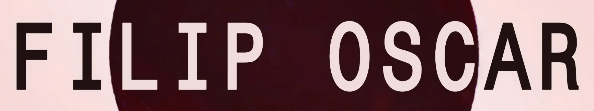

# FILIP OSCAR



A responsive, server-rendered PHP music website for FILIP OSCAR. One main page brings together music, performances, biography and contact links, using the original artwork and typewriter branding.

No framework, database, Composer dependencies, package installation or build step is required.

## Structure

- `index.php` — page entry point, content, metadata and asset version helper.
- `lib/css/site.css` — responsive layout, typography, backgrounds and animations.
- `lib/js/site.js` — media players, biography disclosures and background alignment.
- `lib/js/ripples.js` — standalone WebGL artwork ripples.
- `lib/fonts/` — the original locally hosted WOFF2 typewriter font.
- `lib/img/` — artwork, photography, logo and retained image assets.
- `lib/psd/`, `media/` and `promo/` — retained source, reference and promotional material.
- `.htaccess` and `php.ini` — Apache redirects, caching and compression settings.
- `LICENSE` — copyright and reuse terms.

`private/`, `media/audio/` and `media/digitaldownload/` are ignored by Git. They are not part of the tracked website source.

## Pages

| URL | Purpose |
| --- | --- |
| `/` | FILIP OSCAR homepage |
| `/#listen` | The Way is Golden, music players and other album links |
| `/#watch` | YouTube performances |
| `/#bio` | Introduction and expandable biography |
| `/#contact` | Email and social links |
| `/twig` | Redirect to The Way is Golden on Bandcamp |
| `/raven-white` | Redirect to Raven White on Bandcamp |
| `/brokenness-trio` | Redirect to Brokenness Trio on Bandcamp |

## Run locally

From the repository root, use PHP 8.3 or later:

```sh
php -S 127.0.0.1:8765
```

Open <http://127.0.0.1:8765/>. The PHP development server is for local preview only; it does not apply Apache's `.htaccess` redirects or caching rules.

Run syntax checks in another terminal:

```sh
php -l index.php
node --check lib/js/site.js
node --check lib/js/ripples.js
```

Node.js is only needed for the JavaScript syntax checks, not to serve the site. Browser checks used during development are not included as a repository test suite.

## Editing

| Content | File or directory |
| --- | --- |
| Homepage copy, album links, biography, contact links and metadata | `index.php` |
| Layout, typography, backgrounds and animation timings | `lib/css/site.css` |
| Media player controls, sliding disclosures and raven alignment | `lib/js/site.js` |
| Artwork ripple rendering and interaction | `lib/js/ripples.js` |
| Artwork, photography and README logo | `lib/img/` |
| Original branding font | `lib/fonts/MonospaceTypewriter-webfont.woff2` |
| Production redirects, content types, caching and compression | `.htaccess`, `php.ini` |

Edit these source files directly. CSS and script URLs use file modification times for cache invalidation; there are no compiled bundles to regenerate.

## Interactions and branding

FILIP OSCAR and the FO header mark use the original `monospacetypewriterregular` font with browser-synthesised bold styling and no full stop. Fonts and artwork are served locally.

Bandcamp, Spotify and YouTube embeds load only after a visitor chooses to load them. Direct media links remain available without JavaScript. Close controls remove the player and return keyboard focus to its load button.

The hero and album artwork use pointer- and tap-driven WebGL ripples. Rendering stops when waves settle, artwork leaves the viewport, the tab is hidden, or the album player replaces the image. Unavailable or lost WebGL contexts leave the original image visible; restored contexts rebuild rendering resources. Touch scrolling remains native.

The Watch background and video poster share a seamless 10-second raven animation, with matching tile origins and animation phase across responsive layouts and player resets.

The biography disclosures slide open and closed, handle rapid reversals, and use native `details`/`summary` behaviour without JavaScript. The Hello background and gradient retain their collapsed-section size as disclosures expand; their size adapts to width and font changes.

Button colours and borders use 0.2-second ease transitions. Reduced-motion preferences disable decorative animation, ripples and disclosure motion. The page includes a skip link, keyboard focus styles and image descriptions.

Legacy compiled CSS, Font Awesome, jQuery, ripple/scrolling plugins, font demos, unused font formats and the obsolete Universal Analytics tag have been removed.

## Hosting and release

1. Back up the current deployment and preview changes on staging.
2. Deploy the current tracked website files together.
3. Remove retired frontend files and `gzip.php` from older deployments.
4. Serve the site over HTTPS with PHP 8.3+ and Apache 2.4.
5. Check canonical and album redirects, compression, caching, media playback and contact links.

`.htaccess` preserves the production domains and album shortcuts. Compression uses Apache `mod_deflate`; `php.ini` disables the previous duplicate PHP compression layer. Shared hosting may require the PHP setting in its control panel. For an HTTPS-terminating proxy, confirm the host's HTTPS detection before enabling redirects.

The configuration uses `mod_rewrite`, `mod_alias`, `mod_mime`, `mod_deflate`, `mod_expires` and `mod_headers`, with optional-module blocks where applicable.

## Review notes

Original biographies, album names and service identifiers are retained. Third-party links, embeds and playlist contents can change independently of this repository.

Development browser checks covered responsive widths of 320, 390, 768 and 1440 pixels; asset loading; keyboard controls and focus restoration; media player lifecycle; JavaScript-disabled browsing; reduced motion; WebGL fallback and context recovery; sliding disclosures; shared raven alignment; and the fixed biography backdrop.

External iframe responses were mocked for interaction checks. These checks do not establish live third-party playback or full accessibility compliance. Production Apache configuration, screen-reader behaviour, browser zoom and embedded-media accessibility need their own checks.

**Licence:** © 2026 Pawel Osmolski (FILIP OSCAR). All rights reserved. Source provided for portfolio, demonstration and evaluation purposes. See [LICENSE](LICENSE) for the full terms. Third-party materials retain their respective copyright and licence terms.
